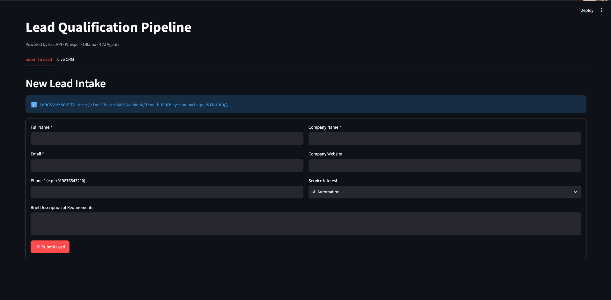
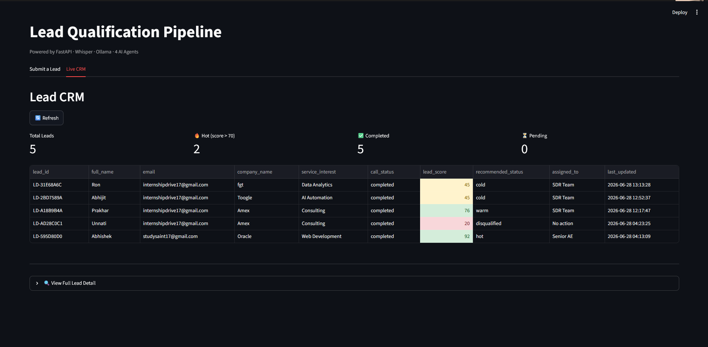
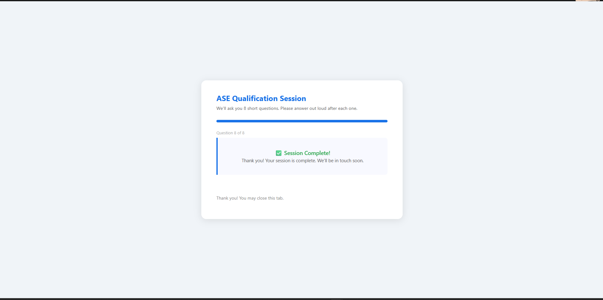
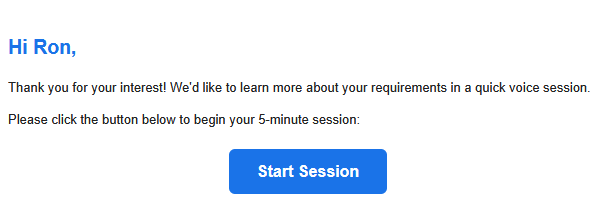
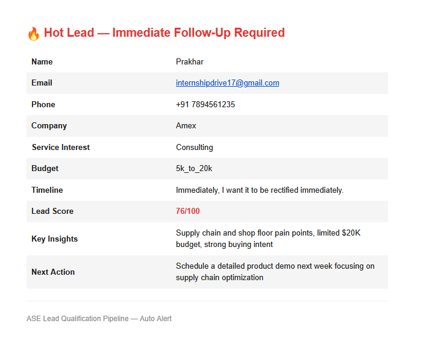

# AI Voice Call Lead Qualification Pipeline

## About This Project

AI Voice Call Lead Qualification Pipeline is a fully local AI powered system that automates the process of qualifying sales leads. It replaces the manual work of calling prospects and asking them questions by running an automated voice session directly in the browser. The system handles everything from collecting lead details to scoring them and alerting the sales team without any human involvement in between.

Sales teams waste hours calling unqualified leads who have no budget no timeline or no decision making power. By the time a sales rep speaks to a prospect they often have no context about what the person needs or whether they are worth pursuing. This project solves that by automatically running a qualification call before any human gets involved saving time and ensuring reps only speak to leads that are actually worth their attention.

A prospect fills a form on the Streamlit dashboard. The system validates their details writes them to a local CSV file and emails them a session link automatically. When the prospect opens the link they answer 8 spoken questions in the browser using their microphone. Their voice is transcribed using OpenAI Whisper running locally on the machine. The transcript is then passed to 4 AI agents powered by gpt-oss:20b-cloud through Ollama. The Discovery Agent extracts business context. The Budget Agent classifies spending capacity. The Sentiment Agent reads tone and buying intent. The Analyst Agent combines everything into a final lead score from 0 to 100. If the score is above 70 the sales rep gets an instant email alert. All results appear live in the CRM dashboard. No manual calls no spreadsheets no guesswork.

## System Requirements

- Python 3.10 or above
- Ollama installed and running locally
- Git Bash or any terminal
- Gmail account with 2FA enabled and App Password generated
- Minimum 8GB RAM recommended because Whisper medium model needs it
- Internet connection required for gpt-oss:20b-cloud model calls through Ollama

## Project Structure

```
ase-lead-pipeline/
├── main.py                        Entry point. Run this to start FastAPI on port 8000
├── dashboard.py                   Streamlit app. Lead intake form and live CRM dashboard
├── requirements.txt               All Python packages needed to run this project
├── .env                           Your secret credentials. Never commit this file
├── .env.example                   Template showing which variables are needed
├── .gitignore                     Tells git which files to ignore
├── README.md                      This file
├── routes/
│   ├── app.py                     Creates the FastAPI app and mounts all routers
│   ├── webhook.py                 Handles POST /webhook/lead from Streamlit form
│   └── session.py                 Serves the voice session page and WebSocket handler
├── pipeline/
│   ├── orchestrator.py            Validates lead writes CSV and sends session email
│   └── voice_session.py           Runs the 8 question voice session with Whisper and TTS
├── agents/
│   ├── discovery_agent.py         Extracts industry pain points and business context
│   ├── budget_agent.py            Classifies budget range with confidence level
│   ├── sentiment_agent.py         Scores tone and buying intent from transcript
│   └── analyst_agent.py           Combines all agents into final lead score and status
├── utils/
│   ├── csv_helpers.py             All CSV read write and update functions
│   ├── validation.py              Email and phone number validation
│   ├── email_sender.py            Sends session link and hot lead alert emails via Gmail
│   └── logger.py                  Logs all pipeline events to console and log file
├── static/
│   └── session.html               Browser voice UI served to the prospect
├── data/
│   ├── leads.csv                  Auto created CRM file with 35 columns
│   └── transcripts/               Stores JSON transcript for each completed session
├── logs/
│   └── pipeline.log               Full timestamped log of every pipeline event
├── docs/
│   └── architecture.md            Mermaid flowchart of the full system
└── scripts/
    └── test_webhook.py            Simulates a lead POST to test pipeline without Streamlit
```

## Environment Variables

Copy .env.example to .env and fill in the values before running the project.

| Variable | Example Value | Description |
|---|---|---|
| GMAIL_USER | yourname@gmail.com | Gmail address used to send all emails |
| GMAIL_PASSWORD | xxxx xxxx xxxx xxxx | 16 character App Password from Google Account security settings |
| GMAIL_TO | salesrep@company.com | Email address that receives hot lead alerts when score is above 70 |
| HF_TOKEN | hf_xxxxxxxxxx | HuggingFace token only needed if Whisper model download fails |
| BASE_URL | http://localhost:8000 | Base URL for session links never change this for local development |

## Installation

1. Navigate into the project folder
```bash
cd ase-lead-pipeline
```

2. Create a virtual environment
```bash
python -m venv .venv
```

3. Activate the virtual environment

Windows Git Bash:
```bash
source .venv/Scripts/activate
```
Mac or Linux:
```bash
source .venv/bin/activate
```

4. Install all required packages
```bash
pip install -r requirements.txt
```

5. Copy the environment file and fill in your credentials
```bash
cp .env.example .env
```

6. Pull the Ollama model
```bash
ollama pull gpt-oss:20b-cloud
```

---

## How to Run

Three separate terminals are needed.

**Terminal 1 - Start Ollama**
```bash
ollama serve
```

**Terminal 2 - Start FastAPI pipeline server**
```bash
cd ase-lead-pipeline
source .venv/Scripts/activate
python main.py
```

**Terminal 3 - Start Streamlit dashboard**
```bash
cd ase-lead-pipeline
source .venv/Scripts/activate
streamlit run dashboard.py
```

## Testing Without the Form

This script sends a fake lead directly to the API without opening Streamlit. Then show the command:
python scripts/test_webhook.py

Watch the python main.py terminal for logs after running this.

## Full Workflow

1. Open http://localhost:8501 in the browser
2. Go to the Submit a Lead tab and fill in name email phone company and service interest
3. Click Submit Lead
4. Watch the python main.py terminal for validation and email logs
5. Open Gmail and find the session link email
6. Click the link which opens http://localhost:8000/session/LD-XXXXXXXX
7. Allow microphone access in the browser when prompted
8. Click Start Session and speak answers to all 8 questions clearly
9. The session completes automatically after question 8
10. Go back to http://localhost:8501 and open the Live CRM tab
11. Click Refresh and see the lead row updated with score status and agent insights

## The 8 Qualification Questions

1. Can you tell me what your business does and which industry you operate in?
2. What are the main challenges or pain points you are currently facing?
3. What tools or software are you currently using for these processes?
4. What kind of solution are you looking for and what outcome do you expect?
5. Regarding budget would you say under 5000 dollars between 5 and 20 thousand or above 20 thousand?
6. What is your expected timeline immediate within 30 days 1 to 3 months or are you still exploring?
7. Are you the decision maker for this project or will others be involved?
8. Would you like a specialist from our team to contact you?

## AI Agents

| Agent | File | What It Does |
|---|---|---|
| Discovery Agent | agents/discovery_agent.py | Extracts industry pain points current tools and red flags from the transcript |
| Budget Agent | agents/budget_agent.py | Classifies budget as under 5k or 5k to 20k or above 20k with a confidence level |
| Sentiment Agent | agents/sentiment_agent.py | Scores prospect tone and buying intent on a scale of 0 to 100 |
| Analyst Agent | agents/analyst_agent.py | Combines all three agent outputs into a final lead score and recommended action |

## Lead Score Guide

Score 85 to 100 means the lead is Hot. Assigned to Senior AE. Requires immediate follow up. Sales rep receives an email alert automatically.
Score 60 to 84 means the lead is Warm. Assigned to SDR Team. Follow up within 24 hours.
Score 30 to 59 means the lead is Cold. Document and monitor. No immediate action needed.
Score 0 to 29 means the lead is Disqualified. No further action taken.

## CSV Column Reference

leads.csv stores all lead data across 35 columns written in 3 phases.

Phase 1 written after form submission:
lead_id, full_name, email, phone, company_name, company_website, service_interest, brief_description, submission_time, is_duplicate, call_status, session_url

Phase 2 written after voice session completes:
q1_industry, q2_pain_points, q3_current_tools, q4_expected_outcome, q5_budget_range, q6_timeline, q7_decision_maker, q8_wants_callback, session_start, session_end, transcript_path

Phase 3 written after all 4 agents finish:
discovery_summary, discovery_flags, budget_category, budget_confidence, sentiment_score, sentiment_label, lead_score, recommended_status, key_insights, next_action, assigned_to, last_updated

## Screenshot Placeholders

Replace these placeholders with actual screenshots after running the project.







## Common Errors and Fixes

| Error | Fix |
|---|---|
| Internal Server Error on session URL | Make sure python main.py is running from inside the ase-lead-pipeline folder not the parent folder |
| Cannot reach FastAPI server | Start python main.py before opening Streamlit |
| Styler object has no attribute applymap | Replace applymap with map in dashboard.py |
| All None values in CRM table | Delete data/leads.csv and restart python main.py to regenerate a clean file |
| Processing your answer stuck after speaking | The audio format is wrong. Fix _transcribe in voice_session.py to save audio as dot webm not dot wav |
| ollama model not found | Run ollama pull gpt-oss:20b-cloud and confirm ollama serve is running in a separate terminal |
| single positional indexer is out of bounds | Add dropna and lead_id filter when reading CSV in dashboard.py |

## Current Limitations

Whisper does a good job and trained on noisy scenarios but it works best in a moderate noise with a clear microphone. If there is background noise or the speaker talks very fast the transcription may miss some words. Speaking at a normal pace in a quiet room gives the best results.

Whisper and the TTS engine run one at a time. If two people open their session links simultaneously one of them may experience a delay. For now this is not an issue since you control who gets the link and when.

The four AI agents use gpt-oss:20b-cloud which needs an internet connection. Whisper runs fully offline but the scoring and insights part requires cloud access through Ollama.

Storing leads in a CSV file makes everything easy to inspect and understand. For a production system with many leads coming in daily you would want to move to a proper database. For small volume use the CSV works great.

## Notes

Gmail requires 2FA to be enabled and an App Password to be generated. The App Password is a 16 character code found in Google Account security settings. It is not your normal Gmail password.

Whisper medium model is approximately 1.5GB and downloads automatically on first run. It only downloads once and is cached locally after that.

The gpt-oss:20b-cloud model routes through Ollama to cloud servers so an internet connection is required during the agent analysis phase.

All lead data stays on your local machine inside data/leads.csv and the data/transcripts folder. Nothing is sent to any external database.
